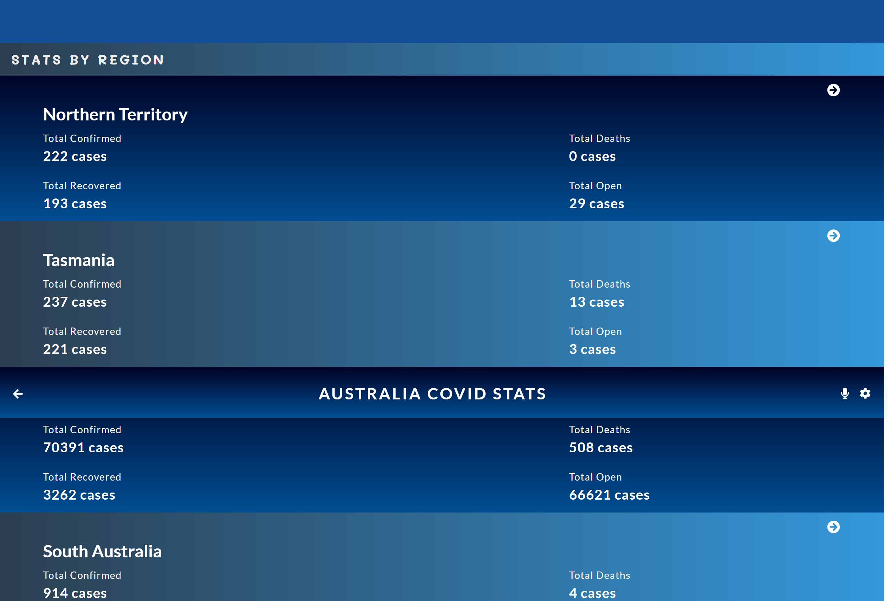

# Covid19 Metrics

> Space Travelers' Hub is single-page application (SPA) that showcases Covid19 data for one hundred and ninety five(195) countries. The data being showcased was fetched from the [Narrativa API](https://covid19tracking.narrativa.com/index_en.html). The fetched data is being displayed in cards on the `Home` page, while data for each country's region is being displayed on the `Details` page. Countries with empty regional data display an informative text to tell users about the unavailable regional data. Every page has a unique route within the SPA.

# Live Link

This [app](https://worlds-covid19.netlify.app/) is being hosted on [Netlify](https://www.netlify.com/)

# Project Presentation

Kindly click [here](https://www.loom.com/share/cf1e3960c0cf4e82a1f03d9536f1b228) to watch the project presentation that was recorded using [Loom](https://www.loom.com)

# Screenshots

### Width - 1440px
### Home Page (World Map)

### Home Page (Search Bar and Countries)

### Details Page (Country Data)

### Details Page (Country Regions Data)

### Details Page (No Regions Message)

# Getting Started

To get a local copy up and running follow these simple steps.

- You can clone this repo by typing `git clone https://github.com/DammyShittu/Covid19-Metrics-App.git` on your terminal.

- Type `cd Covid19-Metrics-App` to access the project on the terminal.
  
- Run `npm install` from your editor's terminal.

- Run `npm start` from your editor's terminal to run the app in the development mode.

- Run `npm run build` to build the app for production.
# Testing

- Run `npm test` to launch the test runner in the interactive watch mode

# Language Used:

This project was bootstrapped with [Create React App](https://github.com/facebook/create-react-app).

Redux

# Version Control System

GIT

# 👤 Author

👤 Adedamola Shittu

GitHub: [@dammyShittu](https://github.com/DammyShittu/)

Twitter: [@aded_shittu](https://twitter.com/aded_shittu/)

LinkedIn: [Adedamola Shittu](https://www.linkedin.com/in/adedamolashittu/)

# 🤝 Contributing

Contributions, issues, and feature requests are welcome!

Feel free to check the [issues page](https://github.com/DammyShittu/Covid19-Metrics-App/issues).

# 🧢 Acknowledgement

Big thanks to [Nelson Sakwa](https://www.behance.net/sakwadesignstudio) for designing the template used and for making it available for use on [Behance](https://www.behance.net/)
# Show your support

Give a ⭐️ if you like this project!

# 📝 License

This project is [MIT](LICENSE) licensed.